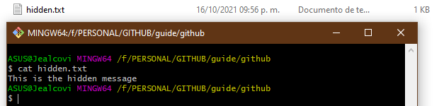

# Tutorial to use git
## _Colin Vilchis J.A_


Git is the most efficient tool to work as a programmer, it allows you to share your code to work collaboratively and maintain version control

## Requirments

- install git
- install git Bash
 
## Commands to navigate

It is important to move between the location of your files, this can be done from the command line

Command to recognize the location of your pointer
```sh
pwd
dir # native windows command
```
The change directory command allows you to change the location of the pointer
```sh
cd  /  # we move to the root, usually called disk C
cd     # we move to the root, usually called disk C
cd .. # It allows us to move to the parent folder of the pointer
cd .  # refers to the current folder
cd / {initial_letter}+tab # autocomplete de comand
```
The list the files that are in the folder where the pointer is
```sh
ls
ls -al # command to show hidden files listed
ls -a # command to show hidden files
```
Clean the console
```sh
ctrl + l
clear
```
Change disc 
```sh
cd /mnt/{disk-name} #linux
cd/{disk-name} #windows remember that windows does not distinguish uppercase letters from lowercase letters
```
Create a folder
```sh
mkdir {project-name}
```

Create a file
```sh
touch {file-name}.txt
```

## Commands to work
Recognize the content of a file

```sh
cat {file-name}.txt
```
 </img>

Remember command history
```sh
history
!1 # repeat the first command, you can select the index you need
```

Delete a file
```sh
rm {file-name}.txt # be careful not to delete important files
```

Help to know a command
```sh
{any} --help
rm --help
```

## Good workflow practices
__Open visual studio code__ 
```sh
code
```

Creation of the work area within Ram memory 
```sh
git init
```
* At this moment the repository is created, identified in the folder .git locally

**Staging** is the area where files are functional, but you need to check and debug
Creation of the work area within Ram memory (clears at power off)

Add your file changes to staging
```sh
git add {file-name}.txt
```

Before add, the files are untraked, they can be identified by the git status command
```sh
git status
```

Remove memory from staging
```sh
git rm
```
__*importante*__
# 3:31

It is a good practice to have branches of our work, by default the main branch is known as **master**

Add staging changes to the final save branch
```sh
git commit "{message to remember}"
```

Read changes from a branch
```sh
git checkout
```

Creation of branches, to work by areas in the same file
```sh
git 
```

Union between branches
```sh
git merge
```
Name of branches
* development #experimental
* hotfix
* main
* master
